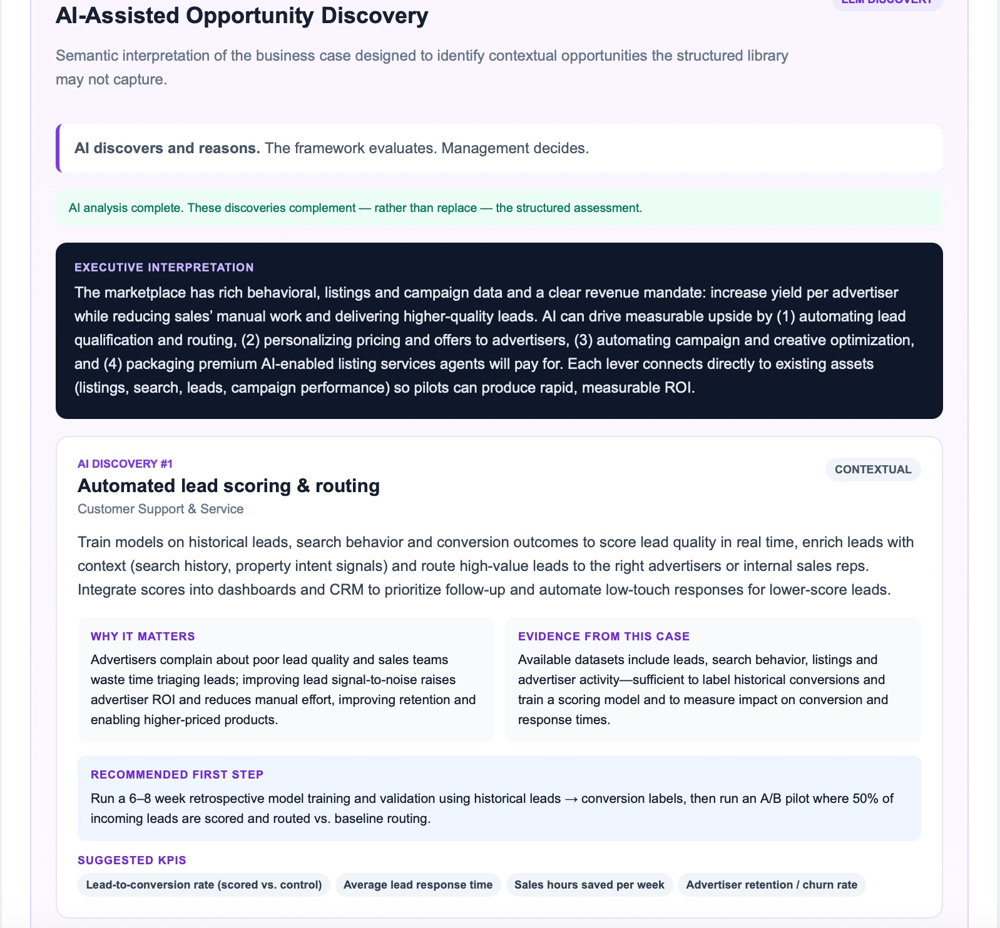

# AI Business Opportunity Mapper

### From business challenge → AI discovery → structured evaluation → management decision → 90-day execution plan

A practical AI-enabled decision-support application for identifying, evaluating and prioritizing where artificial intelligence can create measurable business value.

**V3 combines generative AI with a transparent strategic prioritization framework and human management judgment.**

**Live application:**  
https://javier962.github.io/ai-business-opportunity-mapper/

---

# The Idea

Organizations increasingly know they should be exploring AI.

The harder question is:

> **Where should we actually use it?**

AI strategy conversations often begin with technology:

- Which AI model should we use?
- Which tools should we deploy?
- Where can we add generative AI?
- Which processes can we automate?

I believe the more useful management starting point is different:

> **What business problem are we trying to solve, what value could solving it create, and is AI the right way to address it?**

I built the **AI Business Opportunity Mapper** to explore that approach.

The application starts with the business — its objectives, customers, challenges, business model and available data — and converts that context into potential AI initiatives.

V3 adds a real LLM-powered discovery layer capable of interpreting business context and identifying opportunities beyond the application's predefined opportunity library.

The resulting architecture is deliberately hybrid:

**AI discovers and reasons**

↓

**A structured framework evaluates and prioritizes**

↓

**Management challenges and calibrates**

↓

**The application converts priorities into a 90-day execution plan**

> **AI discovers and reasons. The framework evaluates. Management decides.**

---

# Product Preview

## 1. AI-Assisted Opportunity Discovery

V3 adds an LLM-powered discovery layer that semantically interprets the business context and identifies contextual AI opportunities beyond the predefined library.

The AI explains why each opportunity matters, connects it to evidence from the business case, proposes a practical first step and suggests measurable KPIs.



## 2. Executive AI Opportunity Snapshot

A concise management view of the highest-priority AI opportunities — turning business context into an immediately understandable strategic shortlist.


---

## 3. Management Calibration

The analytical model provides the initial recommendation, but management retains control.

Original model rankings remain visible while executives can reorder priorities and adjust strategic importance.


---

## 4. From Opportunity to Execution

The management-calibrated Top 3 are automatically translated into practical 90-day action plans — moving from validation, to pilot, to an evidence-based **Scale / Iterate / Stop** decision.


---

# What's New in V3 — AI-Assisted Opportunity Discovery

V3 introduces an LLM-powered **AI-Assisted Opportunity Discovery** layer.

The user provides business context including:

- company
- industry
- business model
- company size
- primary strategic objective
- key business challenges
- customer type
- available data and digital assets

The application can then send this context securely to an LLM for semantic interpretation.

Instead of simply matching keywords against a predefined library, the AI can reason about the specific business situation and propose contextual opportunities that may otherwise be missed.

For each AI-discovered opportunity, the application can provide:

- opportunity name
- strategic area
- description
- why it matters
- evidence from the business context
- recommended first step
- suggested KPIs

The LLM does **not** determine the final strategic ranking.

This separation is intentional.

Generative AI is used where it is strongest:

**interpretation, contextual reasoning and discovery.**

The structured framework is used where consistency and transparency matter:

**evaluation and prioritization.**

Management retains responsibility for the final decision.

---

# Two Complementary Analytical Layers

V3 now contains two different ways of looking at the same business problem.

## Structured Model

The structured model evaluates a defined library of AI opportunities using transparent criteria.

Its advantages are:

- consistency
- repeatability
- inspectability
- comparable scoring
- management auditability

## AI Discovery

The generative AI layer interprets the business context semantically and searches for opportunities that may not fit neatly into a predefined library.

Its advantages are:

- contextual understanding
- flexibility
- richer reasoning
- discovery of less obvious opportunities
- industry-specific interpretation

Neither approach is sufficient on its own.

The objective of the project is to explore how **generative intelligence, structured decision frameworks and human judgment can work together**.

---

# What the Application Does

The application takes a business through six stages.

## 1. Understand the Business

The user describes:

- company or project
- industry
- business model
- company size
- primary strategic objective
- key business challenges
- customer type
- available data and digital assets

---

## 2. Discover AI Opportunities

The LLM-powered discovery layer interprets the company's context and identifies potential AI opportunities based on the actual business situation.

This complements the application's structured opportunity library.

---

## 3. Evaluate AI Opportunities

The structured framework evaluates opportunities across six areas:

1. **Revenue Growth**
2. **Operational Efficiency**
3. **Customer Experience**
4. **Customer Support & Service**
5. **Decision Intelligence**
6. **Strategic Advantage & New Business Models**

Examples include:

- AI sales research and lead intelligence
- personalized offers and recommendations
- pricing and monetization optimization
- workflow automation
- document processing
- internal knowledge assistants
- conversational search
- personalized customer journeys
- AI customer-support agents
- customer-service copilots
- churn and retention intelligence
- forecasting
- competitive intelligence
- AI-enabled products and services
- autonomous customer-task agents

---

# 4. Prioritize the Opportunities

Each structured opportunity is evaluated using factors including:

| Dimension | Management Question |
|---|---|
| Business Value | How meaningful could the commercial or strategic impact be? |
| Customer Value | Does it materially improve the customer experience? |
| Strategic Fit | Does it support the company's stated objective? |
| Challenge Relevance | Does it address problems management has identified? |
| Data Readiness | Does the organization appear to have supporting data? |
| Feasibility | Can it realistically be implemented? |
| Time to Impact | How quickly could measurable results emerge? |
| Complexity | How difficult will implementation and organizational change be? |
| Risk | What operational, adoption or governance risks exist? |

The result is a ranked AI opportunity portfolio.

Opportunities are also classified as:

**⚡ Quick Wins** — high feasibility and relatively short time to impact.

**🎯 Strategic Bets** — potentially high-value initiatives requiring greater investment or organizational commitment.

**🔧 Enablers** — capabilities that can support multiple future AI initiatives.

**🧪 Experiments** — opportunities worth testing before larger commitments are made.

---

# 5. Management Calibration

One of the central principles of the project is:

> **The model informs the decision. Management owns the decision.**

Algorithmic prioritization should not be treated as unquestionable strategy.

Management may know things the model does not:

- an important customer is demanding a capability
- a competitor has just entered the market
- regulation is changing
- a strategic partnership is becoming available
- internal capabilities are stronger than assumed
- executive priorities have changed
- an initiative may have strategic value beyond its immediate ROI

The application therefore separates:

### Model Rank

The framework's original analytical recommendation.

### Management Rank

The final priority after management judgment.

Users can:

- move opportunities up or down
- increase strategic importance
- decrease strategic importance
- preserve the original model score
- see where management has overridden the framework

This creates an explicit distinction between **analytical recommendation and executive judgment**.

---

# 6. From Strategy to Execution

Identifying AI opportunities is not enough.

For the management-calibrated **Top 3 priorities**, the application creates a 90-day execution framework.

## Days 1–30 — Validate

Define:

- business hypothesis
- target users or process
- baseline performance
- available data
- stakeholders
- risks
- success criteria

The purpose is to determine whether the opportunity solves a sufficiently important problem before committing significant resources.

## Days 31–60 — Pilot

Run a deliberately limited implementation around:

- one use case
- one customer segment
- one team
- or one workflow

Human oversight remains in place and results are measured against the existing process.

## Days 61–90 — Measure & Decide

Evaluate:

- business impact
- user adoption
- quality
- operational implications
- risk
- economics

Then make an explicit:

**Scale / Iterate / Stop**

decision.

The application also recommends opportunity-specific KPIs such as:

- revenue uplift
- conversion
- qualified opportunities
- hours saved
- process cycle time
- resolution time
- customer satisfaction
- churn reduction
- forecast accuracy
- adoption
- human intervention rate

---

# Hybrid AI Architecture

V3 deliberately separates generative AI from deterministic business logic.

```text
Business Context
       ↓
LLM Reasoning
       ↓
AI Opportunity Discovery
       ↓
Structured Evaluation & Prioritization
       ↓
Management Calibration
       ↓
90-Day Execution Plan
