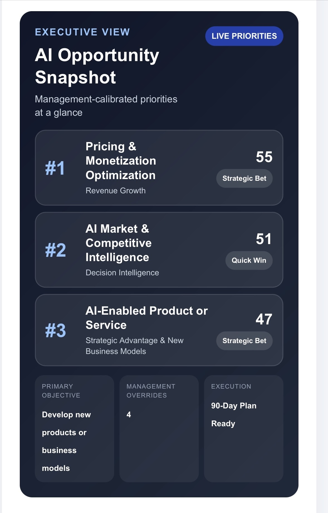
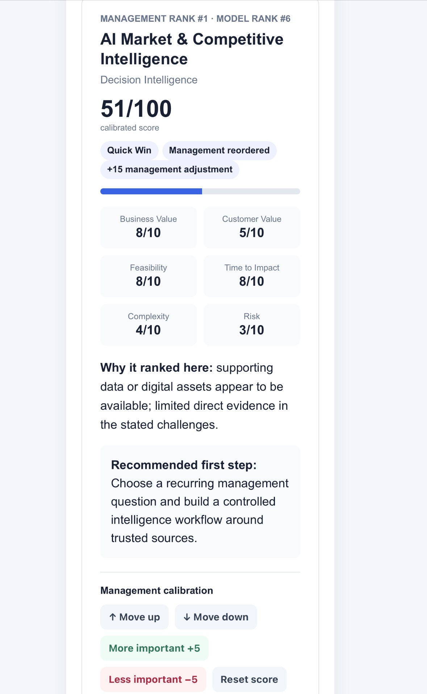
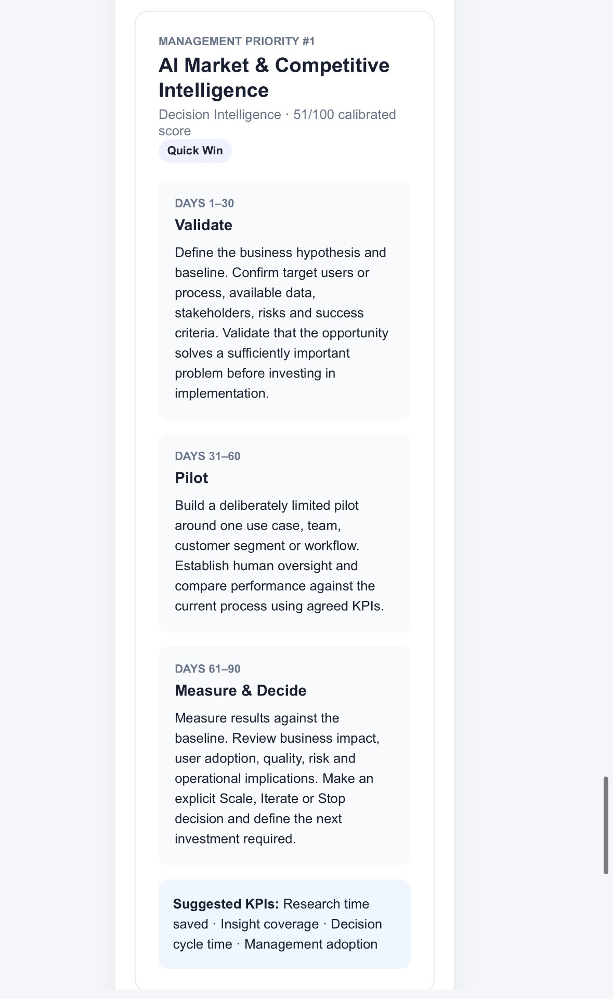

# AI Business Opportunity Mapper

### From business challenge → AI opportunity → management decision → 90-day action plan

A practical decision-support application for identifying, evaluating and prioritizing where AI can create measurable business value.

**Live application:**  
https://javier962.github.io/ai-business-opportunity-mapper/

---
## Product Preview

### 1. Executive AI Opportunity Snapshot

A concise management view of the highest-priority AI opportunities — turning business context into an immediately understandable strategic shortlist.

### 2. Management Calibration

The model provides the initial recommendation, but management retains control. Original model rankings remain visible while executives can reorder priorities and adjust strategic importance.

### 3. From Opportunity to Execution

The management-calibrated Top 3 are automatically translated into practical 90-day action plans — moving from validation, to pilot, to an evidence-based Scale, Iterate or Stop decision.

> **The model informs the decision. Management owns the decision.**
## Why I Built This

AI strategy conversations often start with technology:

> Which AI model should we use?  
> Which tools should we deploy?  
> Where can we add generative AI?

I believe the more useful starting point for management is different:

> **What business problem are we trying to solve, what value could solving it create, and is AI the right way to address it?**

I built the **AI Business Opportunity Mapper** to explore that approach.

Rather than starting with AI capabilities and looking for somewhere to deploy them, the application starts with the company:

- its business model
- strategic objectives
- customer needs
- operational challenges
- available data and digital assets
- implementation constraints

It then translates that context into a prioritized portfolio of potential AI initiatives.

The objective is not to allow an algorithm to make the strategy decision.

The objective is to combine **structured analysis with management judgment**.

---

# What the Application Does

The application takes a business through five stages:

### 1. Understand the Business

The user describes:

- company or project
- industry
- business model
- company size
- primary strategic objective
- key business challenges
- customer type
- available data and digital assets

### 2. Identify AI Opportunities

The framework evaluates potential initiatives across six dimensions:

1. **Revenue Growth**
2. **Operational Efficiency**
3. **Customer Experience**
4. **Customer Support & Service**
5. **Decision Intelligence**
6. **Strategic Advantage & New Business Models**

Examples include:

- AI sales intelligence
- personalization
- pricing optimization
- workflow automation
- document processing
- internal knowledge assistants
- conversational search
- AI customer-support agents
- agent copilots
- churn prediction
- forecasting
- competitive intelligence
- AI-enabled products
- autonomous customer-task agents

---

# 3. Prioritize the Opportunities

Each opportunity is evaluated using factors including:

| Dimension | Question |
|---|---|
| Business Value | How meaningful could the commercial or strategic impact be? |
| Customer Value | Does it materially improve the customer experience? |
| Strategic Fit | Does it support the company's stated objective? |
| Challenge Relevance | Does it address problems management has actually identified? |
| Data Readiness | Does the organization appear to have supporting data? |
| Feasibility | Can it realistically be implemented? |
| Time to Impact | How quickly could measurable results emerge? |
| Complexity | How difficult will implementation and organizational change be? |
| Risk | What operational, adoption or governance risks exist? |

The result is a ranked AI opportunity portfolio.

Opportunities are also categorized as:

**⚡ Quick Wins** — attractive opportunities with relatively high feasibility and short time to impact.

**🎯 Strategic Bets** — potentially high-value opportunities requiring greater investment, organizational commitment or implementation complexity.

**🔧 Enablers** — capabilities that can support multiple future AI initiatives.

**🧪 Experiments** — opportunities worth testing before making larger commitments.

---

# 4. Management Calibration

One of the central design principles of the project is:

> **The model informs the decision. Management owns the decision.**

Algorithmic prioritization should not be treated as unquestionable strategy.

Management may know things the model does not:

- an important customer is demanding a capability
- a competitor has just entered the market
- regulation is changing
- a strategic partnership is becoming available
- internal capabilities are stronger than assumed
- executive priorities have changed
- an initiative may have value beyond its immediate ROI

The application therefore separates:

### Model Rank
The framework's original analytical recommendation.

### Management Rank
The final priority after management judgment.

Users can:

- move opportunities up or down
- increase their strategic importance
- decrease their strategic importance
- preserve the original model score
- see where management has overridden the framework

This creates an auditable distinction between **analytical recommendation and executive judgment**.

---

# 5. From Strategy to Execution

Identifying AI opportunities is not enough.

For the management-calibrated **Top 3 priorities**, the application automatically creates a 90-day execution framework.

## Days 1–30 — Validate

Define:

- the business hypothesis
- target users or process
- baseline performance
- available data
- stakeholders
- risks
- success criteria

The purpose is to establish whether the opportunity solves a sufficiently important problem before committing significant resources.

## Days 31–60 — Pilot

Run a deliberately limited implementation around:

- one use case
- one customer segment
- one team
- or one workflow

Human oversight remains in place and results are measured against the existing process.

## Days 61–90 — Measure & Decide

Evaluate:

- business impact
- user adoption
- quality
- operational implications
- risk
- economics

Then make an explicit:

**Scale / Iterate / Stop**

decision.

The application also recommends opportunity-specific KPIs.

Examples include:

- revenue uplift
- conversion
- qualified opportunities
- hours saved
- process cycle time
- resolution time
- customer satisfaction
- churn reduction
- forecast accuracy
- adoption
- human intervention rate

---

# Case Management

The application supports multiple business assessments.

Users can:

- save a case
- reopen it
- edit it
- duplicate it for scenario analysis
- delete it
- preserve management rankings and score adjustments

This makes it possible to explore different strategic scenarios for the same company.

For example:

**Scenario A:** Revenue Growth  
**Scenario B:** Operational Efficiency  
**Scenario C:** Customer Experience

Current case storage uses browser `localStorage`, keeping the prototype simple and avoiding the need for accounts or a backend.

Saved cases therefore remain on the user's current browser/device and may be lost if browser storage is cleared.

---

# Export & Executive Reporting

Assessments can be exported as:

### PDF / Print

Designed for management review, workshops and discussion.

### CSV

Structured data suitable for Excel or additional analysis.

### TXT

Portable structured output that can also be reused as context for AI tools and further analysis.

Exports preserve the distinction between:

- model ranking
- management ranking
- model score
- management adjustment
- calibrated score

The 90-day roadmap and suggested KPIs are also included in the relevant exports.

---

# How the Current Model Works

Version 2.3 intentionally uses a **transparent rules-based prioritization model** rather than pretending to provide sophisticated AI reasoning where none exists.

The framework considers:

- strategic-objective alignment
- challenge signals
- available-data signals
- business-model fit
- company context
- business value
- customer value
- feasibility
- time to impact
- implementation complexity
- risk

The current version uses keyword/theme matching and weighted scoring to make the logic understandable and inspectable.

This is intentional.

The project explores an architecture in which structured business logic remains understandable even as more advanced AI capabilities are introduced.

---

# Product Philosophy

The longer-term architecture is:

**AI generates and reasons**

↓

**Structured framework evaluates and prioritizes**

↓

**Management challenges and calibrates**

↓

**The application converts priorities into an execution plan**

This avoids two common extremes:

**Pure rules:** transparent, but limited in understanding complex business context.

**Pure generative AI:** flexible and powerful, but potentially inconsistent and difficult to audit.

A hybrid approach can combine the advantages of both.

---

# Current Architecture

The prototype deliberately uses a lightweight architecture:

- HTML
- CSS
- JavaScript
- browser localStorage
- GitHub Pages

There is currently:

- no backend
- no database
- no authentication
- no external API dependency
- no exposed AI API key

This makes the application simple to inspect, deploy and test.

---

# Current Limitations

This is an evolving prototype rather than a production AI strategy platform.

Current limitations include:

- rules-based rather than semantic interpretation of business challenges
- predefined AI opportunity library
- heuristic scoring rather than empirically calibrated ROI prediction
- browser-local case storage
- no multi-user collaboration
- no enterprise data integrations
- no authentication or cloud synchronization

The scores should therefore be interpreted as **decision-support signals, not financial forecasts**.

---

# Future Development

Potential next stages include:

### V3 — AI-Assisted Opportunity Discovery

Use an LLM to interpret company context and propose opportunities beyond the predefined library.

### Semantic Business Analysis

Move beyond keyword matching toward richer understanding of business problems, processes and strategic objectives.

### Explainable AI + Structured Scoring

Allow generative AI to provide contextual reasoning while retaining transparent prioritization criteria.

### Management Override Reasons

Record why executives change a recommendation, for example:

- customer demand
- strategic importance
- executive priority
- competitive pressure
- regulation
- existing internal capabilities

### Cloud Case Management

Optional accounts, cross-device case storage and collaboration.

### Executive Reporting

Generate richer board- or management-ready strategy reports.

### Portfolio Tracking

Move from opportunity identification into pilot tracking, KPI measurement and scale/stop decisions.

---

# Example Use Cases

The framework can be applied across many industries.

A marketplace might evaluate:

- conversational search
- listing recommendations
- pricing intelligence
- lead qualification
- customer-support automation

A B2B technology company might explore:

- AI sales research
- customer-service copilots
- internal knowledge assistants
- churn prediction
- competitive intelligence

A professional-services organization might prioritize:

- document analysis
- knowledge retrieval
- workflow automation
- research intelligence
- AI-enabled advisory services

The underlying question remains the same:

> **Where can AI create enough measurable value to justify implementation?**

---

# What This Project Represents

I am not a software engineer, and this project is not intended to present me as one.

My professional background is in **business growth, digital marketplaces, technology commercialization, international expansion, product strategy and strategic partnerships**.

I have spent much of my career working at the intersection between businesses adopting technology and technology companies bringing new capabilities to market.

This project is an experiment in applying that experience to AI:

**identifying the business problem → structuring the opportunity → understanding the technology → prioritizing investment → retaining human judgment → translating strategy into execution.**

It also reflects how AI is changing the relationship between business professionals and technology.

Increasingly, understanding a business problem deeply, defining the right product logic and working effectively with AI tools can allow non-developers to move from an idea to a functioning prototype much faster than was previously possible.

---

## Live Demo

**Try the AI Business Opportunity Mapper:**

https://javier962.github.io/ai-business-opportunity-mapper/

---

## Project Status

**V2.3 — Working prototype**

Current capabilities:

- contextual business assessment
- AI opportunity mapping
- weighted prioritization
- management calibration
- model vs management ranking
- portfolio classification
- saved cases
- scenario duplication
- PDF / CSV / TXT export
- 90-day execution planning
- opportunity-specific KPI recommendations

---

## Created by

**Javier Ortiz Sanz**

Growth & Technology Executive  
AI · Business Development · International Expansion · Digital Strategy

Built as part of my exploration of practical AI adoption, technology commercialization, business growth and digital transformation.
